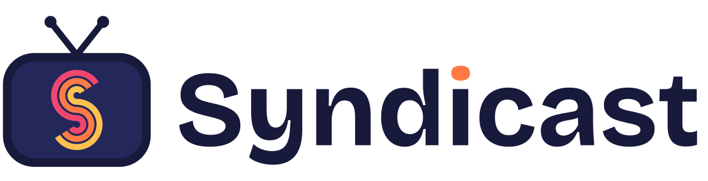

<p align="center">
  <picture>
    <source media="(prefers-color-scheme: dark)" srcset="assets/syndicast-logo-dark.svg">
    
  </picture>
</p>

<p align="center"><strong>Turn your media library into live TV.</strong></p>

Syndicast turns the movies and shows you already own into always-on
TV channels. Build a '90s sitcom channel, a Saturday-morning cartoon
block, or a 24/7 horror marathon, then tune in from Plex, Jellyfin,
Emby, or any IPTV player. No endless scrolling, no deciding what to
watch. Just turn it on and see what's playing.

Syndicast is a fork of [dizqueTV](https://github.com/vexorian/dizquetv),
with its own name and its own roadmap.

## Features

- **Channels from your library.** Pick shows, movies, and music from one or more Plex servers.
- **Real TV scheduling.** Use time slots and random slots, or let a channel shuffle through its lineup.
- **Filler between shows.** Add commercials, trailers, music videos, and bumpers to fill the gaps.
- **Watch anywhere.** Syndicast acts as an HDHomeRun tuner for Plex, Jellyfin, and Emby, and provides M3U and XMLTV links for IPTV apps.
- **Your channel, your look.** Give each channel its own logo and on-screen watermark.
- **Always on, or on demand.** Channels can keep "airing" while nobody watches, or pause until someone tunes in.
- **Built-in TV guide** in the web UI.
- **Subtitles, automatic deinterlacing, and optional direct play.**
- **NVIDIA hardware encoding**, including in Docker.
- **Runs anywhere:** Docker, or standalone apps for Windows, macOS, and Linux.
- **Find things without scrolling.** Filler lists and custom shows can run to hundreds of
  items, so their editors have a search box. The Plex library browser has two: a Filter that
  narrows what is already on screen, and a Keywords box that asks Plex itself. The time and
  random slot editors have one too, matching on show name and day.
- **Different seasons on different days.** Give each time slot its own seasons of a show —
  seasons 1–6 on weeknights, 7–9 on Fridays. Slots set to the same seasons move through
  them together, and a day picker sets a whole weekday block at once.
- **Keep your lists in order.** Drag filler lists and custom shows into whatever order suits
  you, or sort them A–Z, and the order sticks everywhere they appear.
- **Filler straight from Plex.** Point a filler list at a Plex playlist or collection instead
  of picking every clip by hand.
- **Durations at a glance** in the custom show editor, so a mis-tagged file stands out in a
  list of two hundred.

## Differences from dizqueTV

Syndicast forked from dizqueTV's `main` branch, which carries version 1.5.5. The 1.6.0 and
1.7.0 releases were tagged on a line that was never merged back into `main`, so some of the
work below is those releases brought across rather than anything new.

### Added

- Drag-to-reorder and A–Z / Z–A sorting for filler lists and custom shows, stored so every
  page that lists them agrees (`8c2d308`, `3dc0940`)
- Search filters in the filler list and custom show editors, matching anywhere in the title
  (`6f8e31b`, `824618f`)
- A Filter box in the Plex library browser that narrows what is already loaded, and a
  Keywords box that searches a library on the Plex server (`e7874f3`, `5b1b37c`)
- Per-program durations in the custom show editor (`9ac2769`)
- Per-slot season settings, so one time slot can run seasons 1–6 of a show while another
  runs 7–9. Slots asking for the same seasons keep a shared episode position, so a
  weekday block still advances as one thread (`4b0fb56`)
- A day picker and a row filter in the slot editors, so setting a range across
  Monday–Thursday is one edit rather than four found among hundreds of rows

### Brought across from dizqueTV 1.6 and 1.7

- Filler picks content that has never played before, and otherwise whatever has gone longest
  without playing (`1171f22`, from 1.6.0)
- Channels can be saved with a start time in the future (`13ce26f`, from 1.6.0)
- Filler lists can import a Plex playlist or collection (`951a436`, from 1.7.0)

Two 1.7.0 changes were deliberately left out: routing the UI's Plex requests through the
server, which removes the UI Route setting, and moving the ffmpeg path out of the UI.

### Fixed

- Channels were listed in filename order, so the HDHomeRun lineup and XMLTV guide could
  disagree with the M3U and the web UI once you passed nine channels (`39ecb45`)
- Channel icons stored the host and port that created them, so they broke when the server
  moved, and XMLTV and M3U handed those dead URLs to Plex (`604a4e5`)
- The filler and custom show pages tried to sort by name with a comparator returning a
  boolean instead of a number, which cannot reorder anything (`8c2d308`, `3dc0940`)
- The M3U entry shown when no channels exist pointed at a path the server does not serve
  (`604a4e5`)
- The Plex proxy dropped query parameters, so any filter sent through it was ignored
  (`da6f733`)

## Quick Start

### Docker

```bash
docker run -d --name syndicast \
  -p 8000:8000 \
  -v syndicast-data:/home/node/app/.syndicast \
  darkmannx16/syndicast:latest
```

Then open `http://localhost:8000`, connect your Plex server, and start
building channels.

For NVIDIA hardware encoding, use the `latest-nvidia` tag and add
`--runtime=nvidia -e NVIDIA_VISIBLE_DEVICES=all -e NVIDIA_DRIVER_CAPABILITIES=all`.

### Windows, macOS, and Linux

Download the app for your system from the
[Releases page](https://github.com/DarkManX16/Syndicast/releases),
run it, and open `http://localhost:8000`. Your settings are saved in a
`.syndicast` folder inside the folder you run it from.

Options:

| Option | Environment variable | What it does |
| --- | --- | --- |
| `--port 8080` | `PORT` | Runs on a different port (default `8000`) |
| `--database /path/to/folder` | `DATABASE` | Stores your settings somewhere else |

### Switching from dizqueTV?

Stop dizqueTV first, then start Syndicast with your old data folder
mounted at `/home/node/app/.dizquetv` (or run it from the folder that
contains `.dizquetv`). Syndicast will find your channels and settings
and keep using them. Plex will see Syndicast as a new tuner, so add it
again under Live TV & DVR.

## Watching Your Channels

Replace `YOUR-IP` with the address of the computer running Syndicast.

- **Plex, Jellyfin, or Emby:** add an HDHomeRun tuner at `http://YOUR-IP:8000`. For the guide, use `http://YOUR-IP:8000/api/xmltv.xml`. Plex requires Plex Pass for Live TV.
- **IPTV apps:** use the playlist `http://YOUR-IP:8000/api/channels.m3u`. Most apps pick up the guide automatically, or you can add the XMLTV link above.

## Limitations

- **Library changes aren't picked up automatically.** If you add or change media in Plex, re-add those programs to your channels. The same goes for Plex server changes like a new IP or port.
- **Players can stumble between very different files.** If a player breaks when switching episodes, turn on ffmpeg transcoding in the settings. It fixes this at the cost of more CPU or GPU work.
- **Plex DVR records constantly.** If you set up Plex DVR, it will always be recording and transcoding the channel.
- **Keep it private.** Syndicast is meant for your home network. Don't expose its port to the internet unless you know how to secure it.

## Roadmap

- Jellyfin as a media source
- M3U stream links as a media source, so you can mix live streams
  into your channels

## Development

Build the web UI and run the server:

```bash
npm install
npm run build
npm start
```

For live reloading while you work, run these in two terminals:

```bash
npm run dev-client
npm run dev-server
```

To package the standalone apps (uses browserify, babel, and nexe):

```bash
npm run compile
npm run package
```

## Contributing

Pull requests are welcome. Please read the
[Code of Conduct](CODE_OF_CONDUCT.md) and the
[Pull Request Template](pull_request_template.md) first.

## Credits

Syndicast stands on the work of others:

- **[dizqueTV](https://github.com/vexorian/dizquetv)** by vexorian, which Syndicast is forked from
- **PseudoTV** by DEFENDORe, George, and everyone who worked on it, which dizqueTV grew out of
- Everyone who contributed to dizqueTV along the way

## License

Syndicast is released under the zlib license. See [LICENSE](LICENSE).

- The original PseudoTV code is under the [MIT license](https://github.com/DEFENDORe/pseudotv/blob/665e71e24ee5e93d9c9c90545addb53fdc235ff6/LICENSE), © 2020 Dan Ferguson.
- dizqueTV's improvements are under the zlib license, © 2020 Victor Hugo Soliz Kuncar.
- Font Awesome: [fontawesome.com/license/free](https://fontawesome.com/license/free)
- Bootstrap: [MIT license](https://github.com/twbs/bootstrap/blob/v4.4.1/LICENSE)
